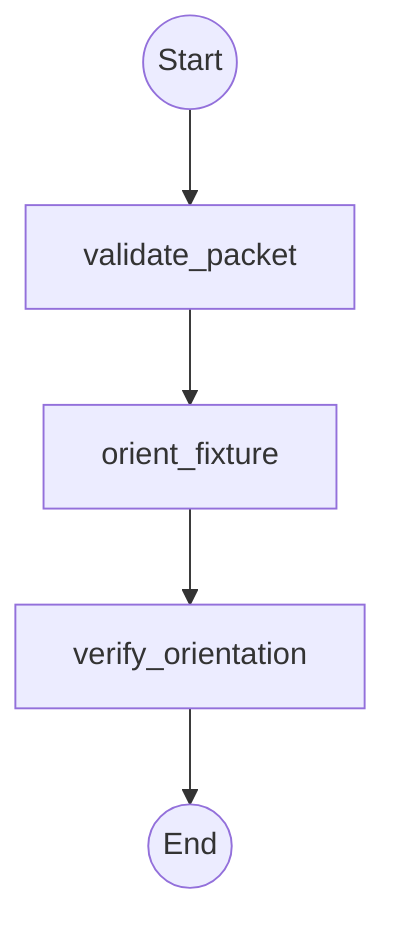

# Workflow: atlas_qualification_ai_orientation

## Topology



## State Schema

```python
class AtlasQualificationOrientationState(TypedDict):
    objective: str
    packet_path: str
    packet_sha256: str
    report_path: str
    delegations_so_far: Annotated[int, operator.add]
    summary: Annotated[List[str], operator.add]
    evidence: Annotated[List[str], operator.add]
    artifacts_or_changed_files: Annotated[List[str], operator.add]
    verification: Annotated[List[str], operator.add]
    risks_or_unknowns: Annotated[List[str], operator.add]
    status: str
    recommended_next_route: str
```

## Agent Nodes

### validate_packet
- **Dispatches to:** `analyst`
- **Access:** `read-only`
- **Task envelope from state:** objective = validate the exact packet digest, source digests, citations, and ceilings; context_and_inputs = `packet_path` and `packet_sha256`; scope = frozen packet and its four-or-fewer cited sources; constraints = no source expansion, no authority inference, no provider or network effect; authority = read-only; deliverable = exact seven-field result; acceptance_evidence = recomputed packet/source digests and observed source/byte/token ceilings; budget = one delegation; escalate_when = any packet, citation, freshness, or ceiling check fails
- **On return:** appends shared result fields and sets `status` and `recommended_next_route`

### orient_fixture
- **Dispatches to:** `analyst`
- **Access:** `read-only`
- **Task envelope from state:** objective = produce one structured cited report identifying the fixture contract, seeded defect, repair boundary, and test command; context_and_inputs = verified packet and `objective`; scope = cited sources only; constraints = every material claim cites a packet source and no write is permitted; authority = read-only; deliverable = exact seven-field result with report in `artifacts_or_changed_files`; acceptance_evidence = report digest and citations resolve against the packet; budget = one delegation; escalate_when = a required claim lacks a cited source
- **On return:** appends shared result fields and sets `status` and `recommended_next_route`

### verify_orientation
- **Dispatches to:** `architect`
- **Access:** `read-only`
- **Task envelope from state:** objective = independently verify the structured orientation report and unchanged fixture bytes; context_and_inputs = packet, report, and earlier exact seven-field results; scope = citations, counters, report contract, and before/after fixture digest; constraints = narration is not proof and this run is not a repeatability claim; authority = prove-only; deliverable = exact seven-field closure result; acceptance_evidence = recomputed report/citation/source digests, three-dispatch counter, and zero diff; budget = one delegation; escalate_when = evidence is missing, fabricated, stale, or outside the frozen boundary
- **On return:** appends shared result fields and sets `status` and `recommended_next_route`

## Routing Rules

- **If** `status == "blocked"` **then** abort, return partial results.

## Initial State

| Field | Initial value |
| --- | --- |
| `delegations_so_far` | `0` |
| `status` | `"pending"` |

