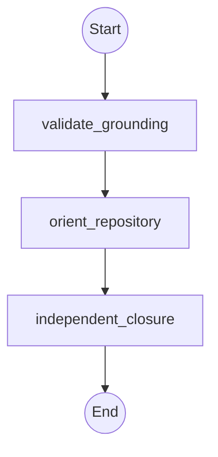

# Workflow: repository_orientation

## Boundary

This is an inactive non-KG-RAG qualification candidate. Atlas supplies a
body-free, digest-bound context packet; In-the-Loop supplies counters,
dispatch, joins, and closure. Context fields cannot populate `authority`,
`approval`, or protected-effect fields. Recovery is read-only and never
restores approval. Unknown roots, unresolved citations, or a stale packet stop
before dispatch. Children never delegate. No result becomes active Atlas
knowledge; it may only become an inactive evidence candidate with its own
source, workflow, agent-result, and verifier provenance.

## Topology



## State Schema

```python
class RepositoryOrientationState(TypedDict):
    objective: str
    packet_path: str
    packet_sha256: str
    selected_sources_max: int
    selected_bytes_max: int
    delegations_so_far: Annotated[int, operator.add]
    authority: Literal["read-only"]
    approval: None
    grounding_valid: bool
    open_findings: Annotated[List[Finding], operator.add]
    summary: Annotated[List[str], operator.add]
    evidence: Annotated[List[str], operator.add]
    artifacts_or_changed_files: Annotated[List[str], operator.add]
    verification: Annotated[List[str], operator.add]
    risks_or_unknowns: Annotated[List[str], operator.add]
    status: str
    recommended_next_route: str
```

## Agent Nodes

### validate_grounding
- **Dispatches to:** `analyst`
- **Task envelope from state:** objective = validate the packet digest, freshness, roots, citations, and selected-source ceilings; context_and_inputs = `packet_path`, `packet_sha256`, `selected_sources_max`, and `selected_bytes_max`; scope = packet metadata and cited sources only; constraints = no source expansion beyond ceilings and no unresolved locator; authority = read-only; deliverable = grounding verdict; acceptance_evidence = recomputed digest, resolved roots/citations, and observed byte/source counts; budget = one delegation; escalate_when = packet is stale, contradictory, or references an unknown root
- **On return:** appends `summary`, `evidence`, `artifacts_or_changed_files`, `verification`, `risks_or_unknowns`; sets `status` and `recommended_next_route`

### orient_repository
- **Dispatches to:** `analyst`
- **Task envelope from state:** objective = answer the bounded orientation question using only verified packet sources; context_and_inputs = grounded packet and objective; scope = declared roots and selected sources only; constraints = unsupported references are findings and agent narration is not verification; authority = read-only; deliverable = cited repository map and explicit unknowns; acceptance_evidence = every material claim resolves to a packet citation; budget = one delegation; escalate_when = the objective requires a write or protected effect
- **On return:** appends shared result fields and sets `status` and `recommended_next_route`

### independent_closure
- **Dispatches to:** `architect`
- **Task envelope from state:** objective = independently validate the orientation result against packet bytes and citations; context_and_inputs = packet, orientation result, and open findings; scope = claim-to-source resolution and limit compliance; constraints = child narration cannot satisfy closure and failed verification remains failed; authority = prove-only; deliverable = complete, partial, or blocked closure verdict plus inactive evidence candidate provenance; acceptance_evidence = independent citation resolution, counter checks, and exact result digest; budget = one delegation; escalate_when = any source, authority, counter, or provenance boundary is obscured
- **On return:** appends shared result fields and sets `status` and `recommended_next_route`

## Routing Rules

- **If** `grounding_valid == false` **then** abort, return partial results.
- **If** `status == "blocked"` **then** abort, return partial results.

The parent checks `delegations_max: 3` before every dispatch. All state updates
are serialized. Any write or protected-effect request returns
`blocked_requires_fresh_approval`; this workflow has no write node. Recovery
revalidates packet digest and freshness, resets authority to read-only, and
does not restore approval. Failed independent verification remains failed;
fixed routing provides no repair cycle.

## Result Contract

Every node returns exactly: `status`, `summary`, `evidence`,
`artifacts_or_changed_files`, `verification`, `risks_or_unknowns`, and
`recommended_next_route`. Evidence-candidate output additionally retains the
packet/source digests, workflow version, agent-result digest, verifier identity,
and verifier-result digest. It remains inactive pending a separate Atlas
admission policy.

## Proof limit

Static workflow qualification can establish the declared envelope, authority,
limit, routing, provenance, and result boundaries. It does not prove execution,
provider behavior, token accounting, or active Atlas admission.
