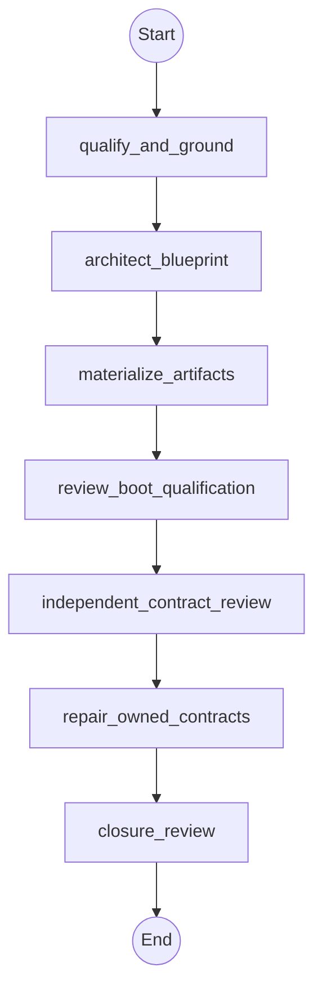

# Workflow: kg_rag_specialist

## Philosophy

This workflow produces a grounded, validated blueprint and deterministic
qualification receipt. It does not answer from a live corpus, call a model,
create an index, provision a service, serialize approval, or claim runtime
readiness. The parent owns questions, approvals, exact commands, joins,
counters, and every protected effect. Children return results and never
delegate.

Every recovery path is read-only. Recovery restores safe progress and
evidence, never authority; fresh active-session approval must name the exact
protected effect and target. The parent enforces the single repair-cycle
ceiling before dispatch.

Call-E requests remain `blocked_pending_authoritative_brief` until the parent
receives rules text, a trusted export, or screenshots and records that source
in the ledger. No child infers competition requirements.

## Topology



## State Schema

```python
class KgRagSpecialistState(TypedDict):
    request: str
    profile: str
    call_e_requested: bool
    authoritative_brief_present: bool
    source_ledger_path: str
    blueprint_path: str
    framework_manifest_path: str
    boot_receipt: str
    qualification_scope: str
    repair_authority: bool
    repair_cycles_so_far: int
    open_findings: Annotated[List[Finding], operator.add]
    operator_findings_present: bool
    fix_owner: str
    summary: Annotated[List[str], operator.add]
    evidence: Annotated[List[str], operator.add]
    artifacts_or_changed_files: Annotated[List[str], operator.add]
    verification: Annotated[List[str], operator.add]
    risks_or_unknowns: Annotated[List[str], operator.add]
    status: str
    recommended_next_route: str
    delegations_so_far: Annotated[int, operator.add]
```

## Agent Nodes

### qualify_and_ground
- **Dispatches to:** `analyst`
- **Access:** `read-only`
- **Task envelope from state:** objective = qualify the request and ground every source-ledger entry without inferring missing requirements; context = `request`, `profile`, `call_e_requested`, and `authoritative_brief_present`; scope = source intake and request qualification only; constraints = unresolved consent, licensing, privacy, or Call-E rules block qualification; authority = read-only; deliverable = grounded source ledger findings; acceptance evidence = attributable locators and declared usage status; budget = remaining delegation ceiling; escalate_when = authoritative source material is missing
- **On return:** appends shared result fields and sets `status`/`recommended_next_route`

### architect_blueprint
- **Dispatches to:** `architect`
- **Access:** `read-only`
- **Task envelope from state:** objective = design the ontology plan, recipe selection, adapters, routes, abstention, deletion, and project-specific evaluation plan; context = qualified request and source-grounding evidence; scope = blueprint architecture; constraints = profile-neutral interfaces and blueprint-only qualification; authority = proposal only; deliverable = decision-complete blueprint architecture; acceptance evidence = capability and evaluation coverage; budget = remaining delegation ceiling; escalate_when = requirements conflict or a capability is undeclared
- **On return:** appends shared result fields

### materialize_artifacts
- **Dispatches to:** `operator`
- **Access:** `workspace-write`
- **Task envelope from state:** objective = materialize the source ledger, ontology plan, recipe selection, blueprint, and evaluation plan at the parent-approved paths; context = architecture result; scope = declared KG-RAG artifacts only; constraints = canonical serialization, no secrets/private bodies/network calls/index creation; authority = exact workspace-write authority supplied by the parent; deliverable = candidate artifacts; acceptance evidence = exact paths and digests; budget = remaining delegation ceiling; escalate_when = an undeclared path or external effect is required
- **On return:** appends shared result fields and sets `blueprint_path`/`source_ledger_path`

### review_boot_qualification
- **Dispatches to:** `analyst`
- **Access:** `read-only`
- **Task envelope from state:** objective = review the parent-observed deterministic validator and Harness Boot outputs for all four fail-closed planes; context = `blueprint_path`, `framework_manifest_path`, and `boot_receipt`; scope = receipt evidence only; constraints = parent alone runs commands and blueprint qualification never implies runtime readiness; authority = read-only; deliverable = ready, degraded, or blocked interpretation; acceptance evidence = canonical receipt digest and plane statuses; budget = remaining delegation ceiling; escalate_when = receipt is stale, noncanonical, or contains authority/private material
- **On return:** sets `qualification_scope` and appends shared result fields

### independent_contract_review
- **Dispatches to:** `architect`
- **Access:** `read-only`
- **Task envelope from state:** objective = independently review the exact candidate against NGF, manifest, recipe, blueprint, evaluation, Call-E, and proof-boundary contracts; context = candidate artifacts and receipt evidence; scope = contract review; constraints = candidates become findings only with a repeatable probe; authority = prove-only; deliverable = owner-tagged findings; acceptance evidence = file/digest/probe for every finding; budget = remaining delegation ceiling; escalate_when = evidence is missing or qualification claims exceed blueprint scope
- **On return:** appends `open_findings`, sets `operator_findings_present`, and appends shared result fields and sets `status`/`recommended_next_route`

### repair_owned_contracts
- **Dispatches to:** `operator`
- **Access:** `workspace-write`
- **Enabled when:** `repair_authority == true`
- **Task envelope from state:** objective = perform one bounded repair of operator-owned contract findings and request fresh parent-observed validation; context = `open_findings`; scope = owner-tagged KG-RAG artifacts only; constraints = one repair cycle, no new features or external effects; authority = exact repair authority supplied by the parent; deliverable = repaired artifacts and fresh evidence paths; acceptance evidence = repeated probes; budget = remaining delegation ceiling; escalate_when = a finding has another owner or requires expanded authority
- **On return:** appends shared result fields and sets `repair_cycles_so_far`/`status`/`recommended_next_route`

### closure_review
- **Dispatches to:** `architect`
- **Access:** `read-only`
- **Task envelope from state:** objective = independently determine whether the exact blueprint candidate satisfies the cookbook contract; context = all findings, fresh receipt, and exact digests; scope = local blueprint qualification; constraints = no commit, push, publication, deployment, installation, model call, or runtime-readiness claim; authority = read-only; deliverable = complete, partial, or blocked closure verdict; acceptance evidence = exact verified artifact digests and zero unresolved required findings; budget = remaining delegation ceiling; escalate_when = any proof boundary or Call-E blocker is obscured
- **On return:** appends shared result fields and sets `status`/`recommended_next_route`

## Routing Rules

- **If** `call_e_requested == true AND authoritative_brief_present == false` **then** stop after `qualify_and_ground`, return `blocked_pending_authoritative_brief`.
- **If** `status != "blocked" OR operator_findings_present == false` **then** skip the disabled `repair_owned_contracts` node and continue to `closure_review`.
- **If** `repair_authority == false AND status == "blocked"` **then** stop before `repair_owned_contracts`, return owner-tagged findings to the parent.
- **Cycle-back if** `status == "blocked" AND open_findings contains fix_owner==operator`: re-run from `repair_owned_contracts` (max 1 cycles).
- **Checkpoint after** `closure_review`: persist state to `checkpoints/kg-rag-specialist.json`.

## Initial State

| Field | Initial value |
| --- | --- |
| `profile` | exactly `"local-deterministic"`, `"production-adapter"`, or `"call-e"` |
| `authoritative_brief_present` | parent-observed; defaults to `false` |
| `qualification_scope` | `"blueprint"` |
| `repair_authority` | caller-supplied; defaults to `false` |
| `repair_cycles_so_far` / `delegations_so_far` | `0` |
| `open_findings` | `[]` |
| `operator_findings_present` | `false` |
| `status` | `"pending"` |
