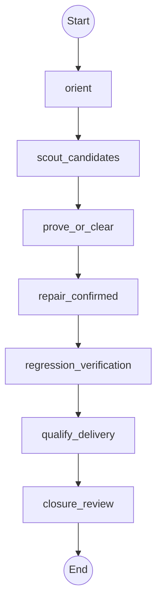

# Workflow: production_auditor

## Philosophy

Candidates are never findings. A finding exists only after a reproducible
probe proves impact against the candidate repository. The parent owns every
command and approval gate; this workflow never pushes, publishes, deploys,
bumps a version, or invents a defect to justify a run.

## Topology



## State Schema

```python
class ProductionAuditorState(TypedDict):
    repo_dir: str
    repair_authority: bool
    audit_mode: str
    candidate_findings: List[Finding]
    findings: Annotated[List[Finding], operator.add]
    false_positives: Annotated[List[Finding], operator.add]
    fix_owner: str
    summary: Annotated[List[str], operator.add]
    evidence: Annotated[List[str], operator.add]
    artifacts_or_changed_files: Annotated[List[str], operator.add]
    verification: Annotated[List[str], operator.add]
    risks_or_unknowns: Annotated[List[str], operator.add]
    status: str
    recommended_next_route: str
    delegations_so_far: Annotated[int, operator.add]
```

## Agent Nodes

### orient
- **Dispatches to:** `explorer`
- **Access:** `read-only`
- **Task envelope from state:** objective = map `repo_dir` and its declared verification, packaging, and CI surface; budget = remaining delegation ceiling
- **On return:** appends shared result fields

### scout_candidates
- **Dispatches to:** `analyst`
- **Access:** `read-only`
- **Task envelope from state:** objective = apply the versioned audit packs as cheap triage; context = orientation evidence; deliverable = candidates, never findings
- **On return:** sets `candidate_findings` and appends shared result fields

### prove_or_clear
- **Dispatches to:** `architect`
- **Access:** `read-only`
- **Task envelope from state:** objective = empirically prove or clear every candidate; context = `candidate_findings`; deliverable = confirmed `findings` plus `false_positives`, each with reproduction and `fix_owner`
- **On return:** appends `findings`/`false_positives` and shared result fields

### repair_confirmed
- **Dispatches to:** `operator`
- **Access:** `workspace-write`
- **Enabled when:** `repair_authority == true`
- **Task envelope from state:** objective = make the smallest shared-layer repair, add a regression test, and update the changelog; context = confirmed `findings`; authority = caller-supplied repair authority only
- **On return:** appends shared result fields and sets `status`/`recommended_next_route`

### regression_verification
- **Dispatches to:** `operator`
- **Access:** `read-only`
- **Task envelope from state:** objective = ask the parent to run exact evidence-producing regression commands and inspect resulting state; context = `findings` and changed artifacts
- **On return:** appends shared result fields

### qualify_delivery
- **Dispatches to:** `analyst`
- **Access:** `read-only`
- **Task envelope from state:** objective = qualify CI, packaging, installer, plugin, and release-evidence boundaries without performing release effects
- **On return:** appends shared result fields

### closure_review
- **Dispatches to:** `architect`
- **Access:** `read-only`
- **Task envelope from state:** objective = independently review the exact candidate and regression evidence in a fresh context; deliverable = clean, partial, or blocked verdict
- **On return:** appends shared result fields and sets `status`/`recommended_next_route`

## Routing Rules

- **If** `repair_authority == false AND status == "blocked"` **then** stop before `repair_confirmed`, return confirmed findings for parent approval.
- **If** `candidate_findings == false` **then** continue with a clean verdict and preserve cleared false positives.
- **Cycle-back if** `status == "blocked" AND findings contains fix_owner==operator`: re-run from `repair_confirmed` (max 2 cycles).
- **Checkpoint after** `closure_review`: persist state to `checkpoints/production-auditor.json`.

## Initial State

| Field | Initial value |
| --- | --- |
| `repair_authority` | caller-supplied, defaults to `false` |
| `audit_mode` | caller-supplied, defaults to `prove-only` |
| `candidate_findings` / `findings` / `false_positives` | `[]` |
| `delegations_so_far` | `0` |
| `status` | `"pending"` |
