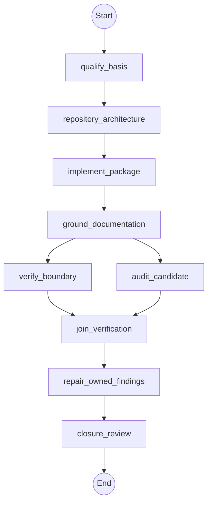

# Workflow: repo_factory

## Philosophy

The caller supplies exactly one creation basis: a raw idea, a proven working
source whose behavior must remain in parity, or a human-approved plan that
already declares goal, audience, boundary, behavior, public interfaces,
constraints, security, packaging, documentation, tests, acceptance evidence,
and release limits. Before the first delegation, the parent acknowledges local
record privacy and serially confirms Literal Task, Strategic Intent,
Boundaries, Task Type, and Relevant Principles against exact revision/digest
pairs. The parent alone performs read-only reconnaissance, presents a separate
plan, binds its approval and sealed authority to revision/digest pairs, and
handles rejection by reconfirming every affected intent item. Missing
requirements are rejected, not invented.

This parent gate is deliberately outside Agent Nodes: it is human interaction
and approval, not a child delegation. Direct source and approved-plan modes
still require confirmed intent before their existing execution path begins.

## Topology



## State Schema

```python
class RepoFactoryState(TypedDict):
    creation_basis: str
    raw_idea: str
    source_path: str
    approved_plan_path: str
    repo_dir: str
    privacy_acknowledged: bool
    five_dot_intent: List[str]
    intent_revision_digest: str
    plan_revision_digest: str
    authority_revision_digest: str
    plan_approved: bool
    repair_authority: bool
    basis_requirements: List[str]
    open_findings: Annotated[List[Finding], operator.add]
    audit_findings: Annotated[List[Finding], operator.add]
    fix_owner: str
    commit_candidate: str
    summary: Annotated[List[str], operator.add]
    evidence: Annotated[List[str], operator.add]
    artifacts_or_changed_files: Annotated[List[str], operator.add]
    verification: Annotated[List[str], operator.add]
    risks_or_unknowns: Annotated[List[str], operator.add]
    status: str
    recommended_next_route: str
    delegations_so_far: Annotated[int, operator.add]
```

## Agent Nodes

### qualify_basis
- **Dispatches to:** `planner`
- **Access:** `read-only`
- **Task envelope from state:** objective = confirm exactly one valid creation basis and reject an incomplete plan; context = confirmed Five-Dot intent plus `raw_idea`, `source_path`, or `approved_plan_path`; constraints = do not infer missing requirements or alter source parity
- **On return:** sets `basis_requirements` and appends shared result fields

### repository_architecture
- **Dispatches to:** `architect`
- **Access:** `read-only`
- **Task envelope from state:** objective = produce repository architecture bounded by source parity or the revision/digest-bound approved plan; context = task dependencies and sealed authority revision/digest
- **On return:** appends shared result fields

### implement_package
- **Dispatches to:** `operator`
- **Access:** `workspace-write`
- **Task envelope from state:** objective = implement code and packaging in `repo_dir`; constraints = preserve proven-source parity or build only approved-plan behavior; authority = sealed authority revision/digest, with no fallback scope, tool, or effect
- **On return:** appends shared result fields

### ground_documentation
- **Dispatches to:** `operator`
- **Access:** `workspace-write`
- **Task envelope from state:** objective = write documentation grounded in implemented, tested behavior; context = current repository and public interfaces
- **On return:** appends shared result fields

### verify_boundary
- **Dispatches to:** `architect`
- **Access:** `read-only`
- **Task envelope from state:** objective = independently verify build, behavior, packaging, documentation, compatibility, and declared boundary using exact parent-approved commands; deliverable = findings tagged with `fix_owner` and observable evidence
- **On return:** appends `open_findings` and shared result fields

### join_verification
- **Dispatches to:** `architect`
- **Access:** `read-only`
- **Join requires:** `verify_boundary`, `audit_candidate`
- **Repair owner:** `operator`
- **Task envelope from state:** objective = consolidate both completed read-only branches, identify any failed branch, and retain each finding's owner
- **On return:** appends shared result fields and sets `status`/`recommended_next_route`

### repair_owned_findings
- **Dispatches to:** `operator`
- **Access:** `workspace-write`
- **Enabled when:** `repair_authority == true`
- **Task envelope from state:** objective = repair only operator-owned findings and rerun their acceptance evidence; context = `open_findings` and `audit_findings`
- **On return:** appends shared result fields

### closure_review
- **Dispatches to:** `architect`
- **Access:** `read-only`
- **Task envelope from state:** objective = independently determine whether the exact local candidate is locally release-ready; constraints = compare the exact verified implementation SHA and artifact manifest; no commit, push, PR, publication, or deployment
- **On return:** sets `commit_candidate`/`status`/`recommended_next_route` and appends shared result fields

## Component Nodes

### audit_candidate
- **Invokes workflow:** `production_auditor`
- **Source:** `production-auditor.itl.md`
- **Access:** `read-only`
- **Execution mode:** `prove-only`
- **Inputs from state:** `child.repo_dir = parent.repo_dir; child.repair_authority = false; child.audit_mode = "prove-only"`
- **On return:** `parent.audit_findings += child.findings; parent.summary += child.summary; parent.evidence += child.evidence; parent.artifacts_or_changed_files += child.artifacts_or_changed_files; parent.verification += child.verification; parent.risks_or_unknowns += child.risks_or_unknowns; parent.status = child.status; parent.recommended_next_route = child.recommended_next_route`

## Routing Rules

- **If** `creation_basis == "approved-plan" AND basis_requirements == false` **then** abort, return partial results.
- **If** `privacy_acknowledged == false OR plan_approved == false` **then** stop before `qualify_basis`, return to the parent approval gate.
- **If** `repair_authority == false AND status == "blocked"` **then** stop before `repair_owned_findings`, return owner-tagged findings.
- **Cycle-back if** `status == "blocked" AND open_findings contains fix_owner==operator`: re-run from `repair_owned_findings` (max 2 cycles).
- **Checkpoint after** `closure_review`: persist state to `checkpoints/repo-factory.json`.

## Initial State

| Field | Initial value |
| --- | --- |
| `creation_basis` | exactly `"raw-idea"`, `"proven-source"`, or `"approved-plan"` |
| `privacy_acknowledged` / `plan_approved` | parent-confirmed before any Agent Node dispatch |
| `five_dot_intent` | all five parent-confirmed intent items, each bound to its revision/digest |
| `intent_revision_digest` / `plan_revision_digest` / `authority_revision_digest` | parent-recorded revision/digest bindings; authority is never restored from a checkpoint |
| `repair_authority` | caller-supplied, defaults to `false` |
| `open_findings` / `audit_findings` | `[]` |
| `delegations_so_far` | `0` |
| `status` | `"pending"` |
