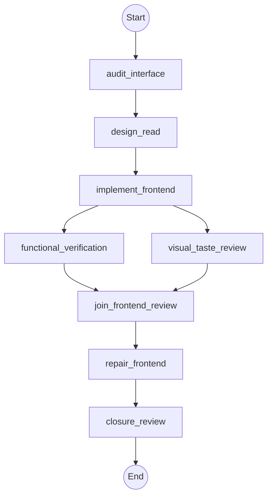

# Workflow: taste_frontend_studio

## Philosophy

This workflow is only for landing pages, portfolios, marketing surfaces, and
approved redesigns. Dashboards, dense tables, multi-step product UI, native
mobile, and realtime collaboration route to the operator and the project's
actual design system. Missing browser or screenshot evidence yields `partial`,
never a visual-pass claim.

## Topology



## State Schema

```python
class TasteFrontendStudioState(TypedDict):
    repo_dir: str
    task_shape: str
    overhaul_authority: bool
    design_approval_required: bool
    repair_authority: bool
    design_read: str
    design_system: str
    browser_evidence_available: bool
    open_findings: Annotated[List[Finding], operator.add]
    fix_owner: str
    summary: Annotated[List[str], operator.add]
    evidence: Annotated[List[str], operator.add]
    artifacts_or_changed_files: Annotated[List[str], operator.add]
    verification: Annotated[List[str], operator.add]
    risks_or_unknowns: Annotated[List[str], operator.add]
    status: str
    recommended_next_route: str
    delegations_so_far: Annotated[int, operator.add]
```

## Agent Nodes

### audit_interface
- **Dispatches to:** `explorer`
- **Access:** `read-only`
- **Task envelope from state:** objective = map the existing interface, routes, navigation, analytics contracts, brand/content assets, accessibility wins, dependencies, and verification surface
- **On return:** appends shared result fields

### design_read
- **Dispatches to:** `frontend_designer`
- **Access:** `read-only`
- **Task envelope from state:** objective = load core Taste guidance and only task-matched specialties, declare the one-line Design Read, dials, and design-system proposal; authority = proposal only
- **On return:** sets `design_read`/`design_system` and appends shared result fields

### implement_frontend
- **Dispatches to:** `frontend_designer`
- **Access:** `workspace-write`
- **Task envelope from state:** objective = implement the approved design; constraints = preserve routes, navigation, analytics, brand assets, content, and accessibility wins unless `overhaul_authority` permits otherwise
- **On return:** appends shared result fields

### functional_verification
- **Dispatches to:** `operator`
- **Access:** `read-only`
- **Task envelope from state:** objective = verify behavior, responsive states, accessibility, performance, build, and tests with observable evidence
- **On return:** appends `open_findings` and shared result fields

### visual_taste_review
- **Dispatches to:** `architect`
- **Access:** `read-only`
- **Task envelope from state:** objective = in a fresh context, use vendored Taste guidance to review screenshots/browser evidence without repairing findings; constraints = missing visual evidence means partial
- **On return:** appends `open_findings` and shared result fields

### join_frontend_review
- **Dispatches to:** `architect`
- **Access:** `read-only`
- **Join requires:** `functional_verification`, `visual_taste_review`
- **Repair owner:** `frontend_designer`
- **Task envelope from state:** objective = consolidate both completed branches, identify a failed branch, and retain owner-tagged findings
- **On return:** appends shared result fields and sets `status`/`recommended_next_route`

### repair_frontend
- **Dispatches to:** `frontend_designer`
- **Access:** `workspace-write`
- **Enabled when:** `repair_authority == true`
- **Task envelope from state:** objective = make the smallest design repair for frontend-owned findings and request fresh evidence
- **On return:** appends shared result fields

### closure_review
- **Dispatches to:** `architect`
- **Access:** `read-only`
- **Task envelope from state:** objective = independently close the exact candidate after at most two repair cycles
- **On return:** appends shared result fields and sets `status`/`recommended_next_route`

## Routing Rules

- **If** `design_approval_required == true AND repair_authority == false` **then** stop before `implement_frontend`, return the design proposal for parent approval.
- **If** `browser_evidence_available == false` **then** return partial, never claim a visual pass.
- **Cycle-back if** `status == "blocked" AND open_findings contains fix_owner==frontend_designer`: re-run from `repair_frontend` (max 2 cycles).
- **Checkpoint after** `closure_review`: persist state to `checkpoints/taste-frontend-studio.json`.

## Initial State

| Field | Initial value |
| --- | --- |
| `overhaul_authority` / `repair_authority` | caller-supplied, defaults to `false` |
| `design_approval_required` | caller-supplied |
| `open_findings` | `[]` |
| `delegations_so_far` | `0` |
| `status` | `"pending"` |
