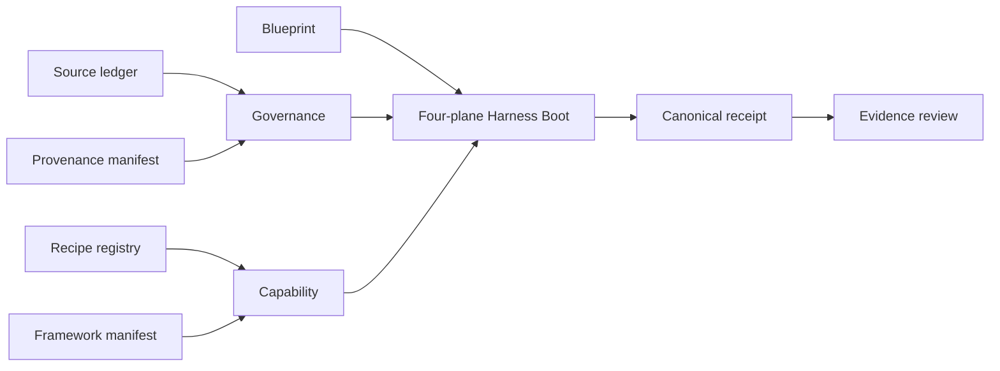

# KG-RAG Cookbook 0.1.0

## [Normative] Scope and precedence

This six-document cookbook MUST be read with the controlling
[NGF format](../../spec/ngf-format.md),
[KG-RAG cookbook contract](../../spec/kg-rag-cookbook.md),
[authority and evidence contract](../../spec/authority-and-evidence.md), and
[orchestration format](../../spec/orchestration-format.md). When statements
conflict, those controlling specifications take precedence over this applied
series. The source ledger MUST resolve every `[source:<id>]` citation.

This release is a provider-neutral, blueprint-only framework. It SHALL describe
artifacts, recipes, qualification, and evidence without claiming a live graph,
retrieval index, generation service, or protected external effect.

## [Normative] Ordered document set

The release MUST contain these documents in this order:

1. **00 — index:** this authority map and reading order.
2. **01 — formalization:** graph, retrieval, provenance, and artifact contracts.
3. **02 — manifest:** separated manifests, eighteen recipes, profiles, and calls.
4. **03 — methodology:** a reproducible blueprint design method.
5. **04 — Harness Boot:** four ordered fail-closed initiation planes.
6. **05 — evaluation:** metrics, threshold selection, receipts, and evidence.

Later documents MAY specialize earlier rules but MUST NOT weaken them.

## [Explanatory] System map

The graph model follows identified resources and typed relations described by
RDF concepts, while constraint and provenance ideas are grounded in SHACL and
PROV-O. JSON-LD supplies a graph-oriented JSON representation. These external
standards explain the design; local specifications remain controlling.
[source:rdf-1.2-concepts] [source:shacl] [source:prov-o] [source:json-ld-1.1]

Retrieval-augmented generation combines retrieval with downstream generation;
graph-oriented approaches add graph construction, traversal, or aggregation.
The cited GraphRAG documentation is vendor-authored and therefore explanatory,
not a source of authority for this cookbook. [source:rag-v4]
[source:microsoft-graphrag]

## [Explanatory] Authority classes

| Class | Meaning in this series | Examples |
|---|---|---|
| Controlling local contract | Governs repository conformance | `spec/` contracts |
| Applied framework | Applies the contract to KG-RAG artifacts | documents 01, 02, and 04 |
| Methodology | Reproducible design guidance | document 03 |
| Evidence | Evaluation and observed receipts | document 05 and canonical receipts |
| External primary | Grounds definitions and methods | RDF, SHACL, PROV-O, JSON-LD, research, risk guidance, telemetry conventions |
| External explanatory | Illustrates one implementation family | vendor-authored graph-RAG documentation |

The repository architecture terminology is a controlling local grounding
source for agent, authority, state, and evidence distinctions.
[source:itl-terminology-177]

## [Explanatory] Quick-start example

A reviewer starts with the source ledger, selects a recipe from the registry,
checks that the framework profile supplies its declared capabilities, writes a
blueprint with bounded traversal and evidence criteria, then runs offline
Harness Boot. A `passed` receipt means the declared artifacts conformed to the
offline contract; it does not mean a live answer was generated.

## [Proposed] Extension points

Future revisions could add domain packs, multilingual entity resolution,
temporal graph policies, or live adapter qualification. An extension should
receive its own schema revision, compatibility statement, fixtures, and proof
boundary before adoption.

## [Normative] Proof limits

This index and the linked documents MUST NOT be treated as proof of live
retrieval, answer correctness, runtime readiness, source truth, external-system
availability, credential validity, deployment safety, or a protected effect.
External citations MUST NOT override local authority or turn explanatory vendor
material into a requirement.

## [Observed] Change history

| Revision | Date | Observation |
|---|---|---|
| 0.1.0 | 2026-08-01 | Initial reviewed six-document controlling set authored for offline qualification. |
