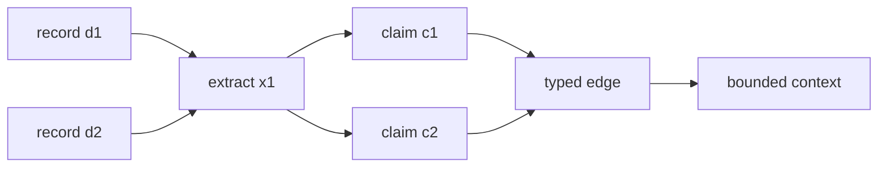

# Formalization and specifications

## [Normative] Mathematical model

Let a graph snapshot be `G = (V, E, tau, a)`, where `V` is a finite set of
identified nodes, `E` is a finite set of directed edges `(u, p, v)`, `tau`
assigns node and edge types, and `a` assigns finite attribute maps. Node and
edge identifiers MUST be unique in the snapshot, every edge endpoint MUST be
in `V`, and attribute values MUST conform to the snapshot's declared shape set.

Let `D` be addressable source records and `C` be atomic claims. A provenance
relation `supports subset D x C` connects records to claims. A derivation graph
`P = (D union C union X, derives)` includes transformations `X`. Every
answer-supporting claim MUST have a finite path to at least one record. The
derivation subgraph MUST be acyclic even when `G` contains domain cycles.

For query `q`, retrieval is:

`R(q, G, D, pi) -> (S, T, K, m)`

where `pi` is the declared policy, `S` is the ordered seed set, `T` is the
bounded traversal subgraph, `K` is the ordered context record set, and `m` is
retrieval metadata. Policy `pi` MUST declare seed method, direction, maximum
depth, maximum candidates, context budget, ranking, tie-break, and empty-result
behavior. Stable identifier order MUST break unresolved ties.

Generation is represented only as the abstract relation
`A(q, K) -> (y, C_y)`, where `y` is a candidate answer and `C_y` its extracted
support claims. This cookbook SHALL NOT execute that relation. A future runtime
assessment MUST check each claim in `C_y` against the provenance paths in `P`.

## [Normative] Provenance and identity invariants

Every record MUST declare a stable identifier, media classification, locator,
content digest or explicit `not_observed`, and source-ledger reference. A
locator MUST NOT embed credentials, private corpus content, or an absolute
path. A digest binds bytes but SHALL NOT be interpreted as source truth.

Every transformation MUST identify ordered inputs, ordered outputs, operation
class, parameter digest, and responsible abstract actor. Merge, split, entity
resolution, summarization, and graph projection MUST preserve a path back to
all materially contributing inputs. A lossy transformation MUST declare that
property.

Blank or local identifiers MAY appear during ingestion but MUST be replaced by
stable snapshot identifiers before qualification. Equivalent-identity claims
MUST carry their rule and confidence or deterministic decision basis; they
MUST NOT silently collapse conflicting records.

## [Normative] Retrieval invariants

The seed stage MUST return no more than its declared limit. Traversal MUST stop
at the first applicable depth, candidate, context, or policy boundary. The
receipt MUST record which boundary caused truncation. Filters MUST run in a
declared order, and an access filter MUST precede context assembly.

Context assembly MUST retain record identifiers and provenance references.
Deduplication MUST identify its equivalence key. Ranking MUST expose component
scores or a deterministic rank rationale. Empty mandatory evidence, unresolved
mandatory provenance, or an exceeded hard budget MUST yield a failed or
blocked verdict rather than an unmarked fallback.

## [Explanatory] Standards grounding

RDF provides a graph data model based on triples and identified resources;
SHACL describes graph validation; PROV-O describes entities, activities, and
agents; JSON-LD maps JSON structures into linked data. The formalization above
uses those ideas without asserting full conformance to each external standard.
[source:rdf-1.2-concepts] [source:shacl] [source:prov-o] [source:json-ld-1.1]

The original RAG research motivates joining retrieved evidence to generation.
Graph-oriented documentation illustrates community summaries and graph-based
query patterns but remains vendor-authored explanatory material.
[source:rag-v4] [source:microsoft-graphrag]

## [Explanatory] Worked miniature

Records `d1` and `d2` describe two entities. Transformation `x1` extracts
claims `c1` and `c2`; `x2` resolves both mentions to nodes `v1` and `v2`; edge
`(v1, related_to, v2)` cites both claims. A query seeds `v1`, traverses one
outgoing hop, and returns `[d1, d2]`. The context order is deterministic because
equal ranks use record identifier order.

## [Explanatory] Failure table

| Condition | Classification | Expected disposition |
|---|---|---|
| Edge endpoint absent | Graph integrity | fail |
| Claim has no record path | Provenance coverage | fail |
| Candidate limit reached | Declared truncation | record and continue if policy permits |
| Access filter omitted | Governance | block |
| Equal ranks lack tie-break | Determinism | fail |
| Source digest absent by declaration | Evidence gap | `not_observed` |
| Domain graph cycle | Allowed topology | apply bounded traversal |
| Provenance derivation cycle | Invalid derivation | fail |

## [Proposed] Advanced semantics

Later revisions could add temporal intervals, named graph partitions,
probabilistic identity, negative evidence, and contradiction-preserving answer
policies. Adoption would require schemas, fixtures, metrics, and migration
rules.

## [Normative] Proof limits

Formal validity MUST NOT be represented as semantic truth, corpus completeness,
answer correctness, fairness, safety, or live-system readiness. Abstract
adapters and transformations MUST NOT be described as implemented or available
without separately observed runtime evidence.

## [Observed] Change history

| Revision | Date | Observation |
|---|---|---|
| 0.1.0 | 2026-08-01 | Initial reviewed formal graph, retrieval, and provenance model recorded. |
