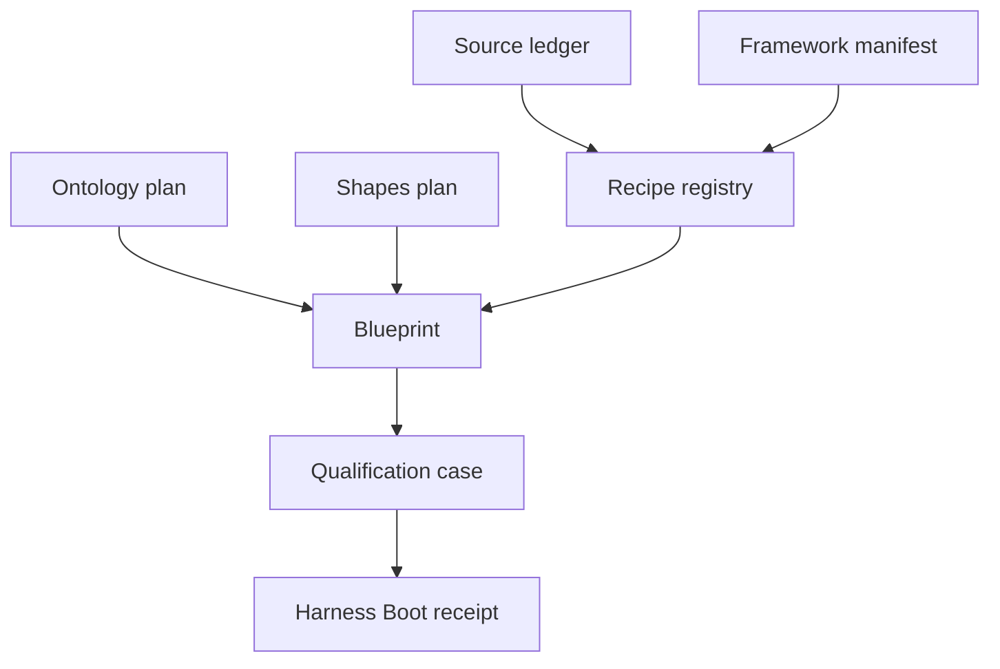

# Manifests, profiles, and recipe catalog

## [Normative] Separated artifact contract

The source ledger, framework manifest, recipe registry, qualification manifest,
ontology plan, shapes plan, blueprint, and receipt MUST remain separate closed
artifacts. A consumer MUST validate each artifact against its declared format
before resolving cross-references. Unknown fields and unknown identifiers MUST
fail closed.

| Artifact | Responsibility | Forbidden substitution |
|---|---|---|
| `source-ledger.json` | source identity, standing, access date, and location | copied source body or runtime availability |
| `framework-manifest.json` | profiles, routes, adapter kinds, and network policy | adapter implementation |
| `recipe-registry.json` | reusable route and grounding requirements | blueprint-specific thresholds |
| `qualification.json` | cases, expected outcomes, and required planes | observed receipt |
| `ontology-plan.json` | planned classes and edge vocabulary | deployed ontology |
| `shapes-plan.json` | planned constraints | executable shape graph |
| blueprint | selected profile, recipe, route, limits, adapters, governance | execution transcript |
| receipt | canonical offline plane verdicts and input digests | live-system proof |

Cross-artifact references MUST use stable identifiers. Repository paths MUST be
safe relative paths. A digest MUST bind exact canonical bytes. A declaration of
an abstract adapter MUST NOT be interpreted as adapter availability.

## [Normative] Source standing

The ledger MUST distinguish external normative standards, research, and
explanatory material. Source standing describes grounding use, not local
control. The local specifications SHALL remain the controlling authority.
Vendor-authored documentation MUST remain explanatory and MUST NOT define a
qualification threshold or unblock a reserved call.

The Call-E authoritative brief MUST be a distinct resolvable ledger entry. Its
absence MUST produce `blocked_pending_authoritative_brief`; similarity to
another recipe SHALL NOT satisfy that dependency.

## [Normative] Profiles and routes

The framework manifest MUST expose exactly these states for release 0.1.0:

| Profile | Route | Maturity | Network policy | Qualification meaning |
|---|---|---|---|---|
| `local-deterministic` | `local-hybrid` | `executable` | `forbidden` | deterministic offline contract exercise |
| `production-adapter` | `production-hybrid` | `abstract` | `declared-only` | adapter compatibility, degraded without runtime proof |
| `call-e` | `call-e` | `blocked` | `declared-only` | blocked pending authoritative brief |

Every profile MUST declare graph, vector, generation, and telemetry adapter
kinds. `executable` in this manifest SHALL mean executable by the local
blueprint harness only. `abstract` SHALL yield a degraded result when runtime
evidence is outside scope. `blocked` MUST remain non-ready.

## [Normative] Canonical registry and cookbook recipes

The machine registry contains exactly the eighteen ordered recipes below. A
blueprint MUST select compatible registry entries and MUST NOT add an
undeclared route, source, adapter, capability, or network effect.

Every design recipe MUST declare inputs, outputs, capability needs, failure
behavior, provenance obligation, evaluation dimensions, and compatible
profiles. The table is the concise declaration: `L` means
`local-deterministic`, `P` means `production-adapter`, and `E` means the blocked
Call-E profile. Unless a row narrows it, failure behavior is fail closed for a
missing mandatory input and provenance requires record-to-output paths.

| # | Recipe identifier | Inputs -> outputs | Capability needs | Failure behavior | Evaluation dimensions | Profiles |
|---:|---|---|---|---|---|---|
| 01 | `source-intake` | source candidates -> governed ledger entries | source ledger | reject unlicensed input | freshness/deletion, protected effects | L, P, E |
| 02 | `ontology-design` | intent and vocabulary -> ontology/shapes plan | ontology shapes | block missing shapes | triple/path validity | L, P, E |
| 03 | `chunking` | governed records -> stable chunks | canonical graph artifacts | reject unstable IDs | retrieval recall/precision | L, P, E |
| 04 | `entity-relation-extraction` | chunks and ontology -> mentions/claims | bounded extraction | preserve source address | entity resolution, triple validity | L, P, E |
| 05 | `entity-resolution` | mentions -> stable/unresolved entities | resolution policy | preserve collisions | false merges/splits | L, P, E |
| 06 | `graph-construction` | claims and lineage -> graph snapshot | graph construction | reject ungrounded edge | triple/path validity | L, P, E |
| 07 | `lexical-vector-indexing` | chunks and graph -> index declarations | lexical/vector indexing | declare absent capability | retrieval recall/precision | L, P, E |
| 08 | `query-classification` | query -> declared route | classification | abstain on unsupported route | ranking | L, P, E |
| 09 | `graph-traversal` | seeds and graph -> bounded subgraph | bounded traversal | stop at declared bounds | path validity, latency | L, P, E |
| 10 | `community-global-retrieval` | query and communities -> candidates | community/global retrieval | fall back or abstain | recall, ranking | L, P, E |
| 11 | `hybrid-fusion` | lexical/vector/graph candidates -> fused candidates | hybrid fusion | deterministic empty result | precision, ranking | L, P, E |
| 12 | `reranking` | candidates -> ranked evidence | reranking | stable-ID tie-break | ranking, latency | L, P, E |
| 13 | `evidence-packet-assembly` | evidence and lineage -> packet | evidence assembly | reject incomplete provenance | citation coverage, path validity | L, P, E |
| 14 | `cited-answering` | packet -> cited answer plan | cited answering | omit unsupported claim | citation precision/coverage, consistency | L, P, E |
| 15 | `contradiction-handling` | conflicting claims -> preserved conflict set | contradiction handling | retain both sides | contradiction response | L, P, E |
| 16 | `abstention` | sufficiency result -> answer/abstain decision | abstention | abstain when insufficient | abstention | L, P, E |
| 17 | `update-deletion-reindexing` | source mutation -> tombstones/rebuild plan | lifecycle handling | block stale result | freshness/deletion | L, P, E |
| 18 | `adversarial-evaluation` | blueprint and cases -> evaluation plan | adversarial evaluation | fail closed | injection/protected-effect refusal | L, P, E |

## [Explanatory] Manifest flow

RDF, SHACL, PROV-O, and JSON-LD ground the graph and provenance vocabulary.
The RAG paper grounds the retrieval-plus-generation pattern. Risk and telemetry
sources inform governance and observation design. [source:rdf-1.2-concepts]
[source:shacl] [source:prov-o] [source:json-ld-1.1] [source:rag-v4]
[source:nist-ai-rmf-1.0] [source:otel-semconv-1.40.0]

## [Explanatory] Failure examples

| Example | Plane affected | Result |
|---|---|---|
| Blueprint selects an absent ontology or shapes artifact | corpus | blocked |
| Route is not allowed by profile | retrieval | failed |
| Adapter profile and route disagree | retrieval | failed |
| Network use appears under forbidden policy | governance/session | blocked |
| Threshold is absent | evaluation | failed |
| Call-E brief is absent from ledger | governance/session | blocked pending brief |

## [Proposed] Registry expansion

The eighteen design recipes could become individually closed machine records in a
future registry revision. That change would benefit from per-recipe fixtures,
compatibility migration, and explicit composition ordering.

## [Normative] Proof limits

Manifest validity MUST NOT be reported as a deployed graph, populated index,
working adapter, generated answer, qualified network path, source truth, or
operational readiness. The production profile MUST remain degraded without
separate runtime evidence, and Call-E MUST remain blocked while its controlling
brief is absent.

## [Observed] Change history

| Revision | Date | Observation |
|---|---|---|
| 0.1.0 | 2026-08-01 | Initial reviewed manifest separation, profile map, and eighteen-recipe catalog recorded. |
