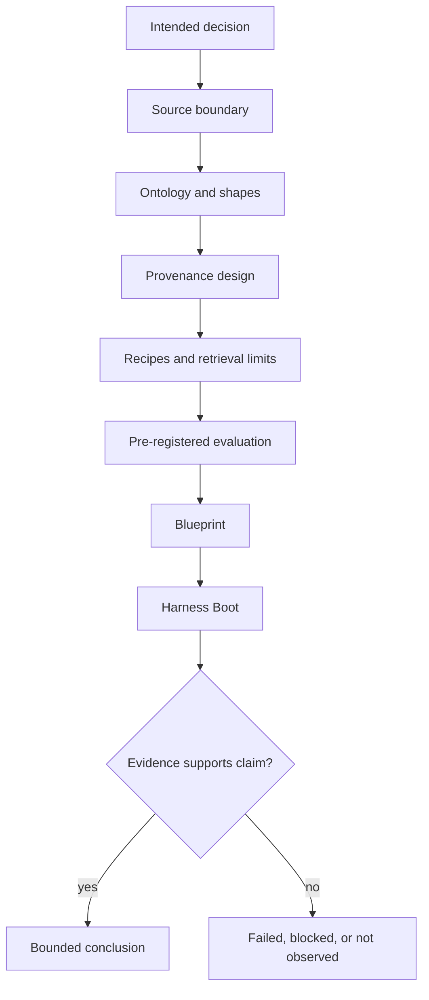

# Blueprint methodology

## [Normative] Method contract

A cookbook study MUST produce a reviewable blueprint, not a claim of live
implementation. The study MUST identify its question, corpus boundary, graph
purpose, source standing, recipe, profile, route, ontology plan, shape plan,
retrieval policy, adapter declarations, governance controls, evaluation
criteria, and proof limits before qualification.

Design decisions MUST be traceable to a requirement, a cited grounding source,
or an explicit proposal. Assumptions MUST be labeled and MUST NOT be promoted to
observations. A recovered plan or prior receipt SHALL provide context only and
MUST NOT restore authority for a protected effect.

## [Normative] Nine-step procedure

1. **Frame the decision.** Define users, permitted decisions, excluded uses,
   success claims, harms, and a bounded query population.
2. **Govern sources.** Inventory records, classify standing and sensitivity,
   assign stable identifiers, and define retention and access boundaries.
3. **Model the graph.** Select classes, edge vocabulary, identity policy,
   contradiction policy, and constraints before retrieval tuning.
4. **Design provenance.** Map each transformation and every expected result
   claim back to addressable records.
5. **Select recipes.** Choose one machine qualification recipe and the ordered
   cookbook recipes needed for the use case.
6. **Select a profile and route.** Confirm compatibility, adapter declarations,
   network policy, and fail-closed behavior.
7. **Bound retrieval.** Fix seed policy, directions, depth, candidate count,
   ranking, tie-break, context budget, and empty-result behavior.
8. **Pre-register evaluation.** Define populations, metrics, thresholds,
   aggregation, sample sufficiency, tolerances, and stop conditions.
9. **Qualify the blueprint.** Run the four Boot planes, preserve the canonical
   receipt, compare the result with the expected outcome, and report only what
   the evidence establishes.

Each step MUST leave an artifact or an explicit `not_observed` state. A hard
governance gap MUST stop qualification. Iteration MAY revisit an earlier step,
but the new blueprint revision MUST invalidate receipts bound to changed bytes.

## [Normative] Blueprint decision record

The decision record MUST answer the following questions:

| Decision | Required declaration | Fail-closed condition |
|---|---|---|
| Intended use | actor, decision, output, exclusions | use is open-ended |
| Corpus | included records, snapshot, access class | record identity is unstable |
| Ontology | classes, edges, shapes, version | required ontology is absent |
| Provenance | transformations and claim paths | mandatory claim lacks a source path |
| Retrieval | seeds, traversal, ranking, limits | route or threshold is absent |
| Adapters | kind, maturity, network need | profile mismatch or undeclared network |
| Risk | hazard, control, owner, residual state | mandatory control has no owner |
| Evaluation | metric, population, threshold, sufficiency | threshold selected after observation |
| Evidence | receipt path and artifact digests | evidence binds different bytes |

The record MUST declare whether a threshold is a safety floor, a quality floor,
or a budget ceiling. Threshold choice SHALL precede scoring. Any post-hoc
change MUST create a new evaluation revision.

## [Normative] Graph and retrieval design rules

The graph MUST be justified by query needs. A class or edge without a query,
governance, provenance, or evaluation use MUST be omitted or labeled proposed.
Identity resolution MUST preserve conflicts and source lineage. Shape severity
MUST map deterministically to warning, failure, or blocking behavior.

The retrieval design MUST include a text-only or empty-result comparison where
applicable. Hybrid weights MUST be pre-registered. Traversal MUST be bounded by
depth and candidate count. Context assembly MUST apply access filtering before
ranking output becomes answer context. A deterministic tie-break MUST be
defined even if component scores are expected to differ.

## [Explanatory] Rationale and grounding

The method adopts a graph-first separation of identified resources, constraint
checking, and derivation lineage from RDF, SHACL, and PROV-O. JSON-LD offers a
portable representation idea. [source:rdf-1.2-concepts] [source:shacl]
[source:prov-o] [source:json-ld-1.1]

Retrieval-augmented generation research motivates measuring retrieval and
answer support separately. Graph-oriented vendor documentation illustrates
possible graph construction and community-query patterns, but it is not a
controlling methodology source. [source:rag-v4] [source:microsoft-graphrag]

Risk framing draws on the risk-management lifecycle, and observation naming is
informed by external semantic conventions without treating telemetry as proof
of task success. [source:nist-ai-rmf-1.0] [source:otel-semconv-1.40.0]

## [Explanatory] Example study

Consider an offline corpus of reviewed policy notes. The decision is limited to
finding cited relationships, not recommending action. The graph uses
`Document`, `Entity`, `Claim`, and `Source`, with `mentions`, `supports`, and
`cites`. `local-baseline` selects `local-hybrid`; cookbook recipes 01, 04, 05,
06, 10, 11, 14, and 15 define the data path. Traversal is one outgoing hop,
candidate count is fifty, and equal scores sort by stable identifier.

The example blueprint records abstract adapters and synthetic thresholds. A
passing Boot receipt supports structural readiness for the offline exercise
only. It says nothing about the quality of policy answers.

## [Explanatory] Common failure patterns

| Pattern | Why it fails | Repair route |
|---|---|---|
| Ontology copied from a source with no query mapping | needless complexity | start from decisions and queries |
| Entity merge discards disagreement | provenance loss | preserve mentions and equivalence rationale |
| Threshold chosen after seeing results | biased evaluation | create a new pre-registered revision |
| Graph score alone represents answer quality | category error | assess retrieval and claim support separately |
| Telemetry event represents success | observation confused with evidence | pair events with independent assertions |
| Abstract production adapter labeled ready | proof boundary exceeded | report degraded until runtime evidence exists |
| Adjacent-call brief used for Call-E | authority inferred | remain blocked pending exact brief |

## [Proposed] Pilot-to-runtime transition

A later runtime phase could add owned corpus ingestion, adapter conformance,
privacy review, adversarial evaluation, load tests, monitoring, and rollback
evidence. Such a phase would need fresh authority and a separate evidence
contract; it is not implied by blueprint qualification.

## [Normative] Proof limits

Following this methodology MUST NOT be represented as proof that source claims
are true, the corpus is complete, retrieval is useful, answers are correct, an
adapter operates, risks are acceptable, or a production system is ready. A
method artifact MUST NOT authorize ingestion, network access, generation,
publication, deployment, or any other protected effect.

## [Observed] Change history

| Revision | Date | Observation |
|---|---|---|
| 0.1.0 | 2026-08-01 | Initial reviewed nine-step blueprint methodology recorded. |
