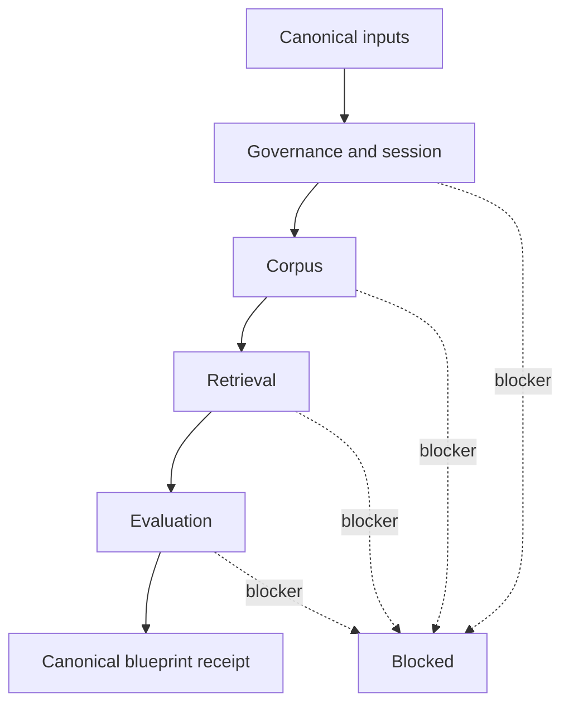

# AI Harness initiation and boot

## [Normative] Boot contract

Harness Boot MUST be an offline, deterministic qualification of declared
blueprint artifacts. It MUST NOT call a model, contact a service, create a
graph or vector index, ingest a corpus, provision an adapter, restore
authority, or claim runtime readiness. Its only qualification scope MUST be
`blueprint`.

Boot MUST evaluate four planes in this order: `governance_session`, `corpus`,
`retrieval`, and `evaluation`. Each plane MUST emit `ready`, `degraded`, or
`blocked` plus stable reason codes. A blocking result MUST prevent later
planes from reporting `ready`; later planes MAY report additional blockers
without erasing the first cause.

Boot MUST accept canonical blueprint and framework-manifest bytes, resolve
only declared safe relative artifacts, recompute their digests, and emit one
canonical receipt. Identical bytes and repository state MUST yield
byte-identical receipts.

## [Normative] Governance and session plane

The governance/session plane MUST verify:

- bounded intent and a declared `qualification_scope` of `blueprint`;
- active-session authority limited to any requested local receipt write;
- privacy classification and explicit exclusion of secrets and private bodies;
- source consent, license or usage status, retention, and deletion policy;
- declared compute, latency, and cost-observability budgets;
- network policy and the absence of hidden external calls; and
- recovery semantics that restore safe progress but never approval.

Missing consent, forbidden license status, an invalid retention policy,
credential-shaped content, undeclared network use, or an authority field in a
receipt MUST block the plane.

## [Normative] Corpus plane

The corpus plane MUST verify source-ledger identity, stable locators, declared
freshness, ontology and shape artifacts, extraction policy, entity-resolution
policy, contradiction preservation, and update/deletion/reindexing behavior.
Every declared source identifier MUST resolve. Every local artifact path MUST
be safe, regular, and digest-bound.

The plane MUST block on a missing ontology or shapes plan, unresolved source,
digest mismatch, unlicensed or unauthorized input, path traversal, absent
deletion handling, or a claim that provenance metadata is integrity proof.
RDF, SHACL, PROV-O, and JSON-LD inform the graph, constraint, provenance, and
serialization plans respectively. [source:rdf-1.2-concepts] [source:shacl]
[source:prov-o] [source:json-ld-1.1]

## [Normative] Retrieval plane

The retrieval plane MUST verify the selected recipe set, capability inventory,
adapter declarations, query classifier routes, traversal limits, hybrid
fusion, reranking, fallback, evidence-packet assembly, and abstention policy.
The `local-deterministic` profile MUST declare canonical JSON or JSONL graph
and vector artifacts, an offline lexical baseline, and no hidden network use.
The `production-adapter` profile MUST declare abstract graph-store, vector-
index, lexical-index, embedder, reranker, answerer, and observability
interfaces without selecting a provider.

An unsupported query route, missing capability, adapter mismatch, undeclared
network use, unbounded traversal, or absent fallback/abstention policy MUST
block the plane. Abstract adapters MUST produce at most `degraded`, never a
runtime-ready claim.

## [Normative] Evaluation plane

The evaluation plane MUST verify fixture identities, mandatory metric
coverage, project-specific thresholds, baseline state, adversarial cases,
evidence policy, and receipt proof limits. Thresholds MUST be declared before
results. A universal quality threshold MUST NOT be invented.

The plane MUST block when a mandatory metric lacks its population, direction,
threshold, rationale, or sufficiency policy; when injection and protected-
effect refusal cases are absent; or when evidence is bound to different
artifact bytes. A structurally valid plan with abstract production adapters
MAY be `degraded` when all blockers are absent.

## [Normative] Call-E gate

The `call-e` profile MUST emit `blocked_pending_authoritative_brief` until
rules text, a trusted export, or screenshots are supplied and recorded as a
controlling source-ledger entry. Competition requirements MUST NOT be inferred
from adjacent material, names, memory, or explanatory sources. The receipt
MUST preserve the blocker without embedding the missing brief.

## [Normative] Receipt fields and serialization

The receipt MUST contain its contract identifier, `qualification_scope`,
overall status, four named plane records, blueprint and manifest digests,
declared capabilities, sorted unique warnings, and sorted unique blockers. It
MUST state that runtime readiness is not qualified. It MUST NOT contain
approval, authority, credentials, tokens, prompts, private content, service
handles, model output, or index contents.

An optional output path MUST be POSIX-relative, contained below the active
working directory, and non-symlinked. Without an output path, canonical bytes
MUST be written to standard output and diagnostics MUST be written separately.

## [Explanatory] Boot sequence

The four-plane shape adapts risk governance, provenance, graph constraints,
retrieval research, and telemetry naming without treating any external source
as proof that a local blueprint works. [source:nist-ai-rmf-1.0]
[source:prov-o] [source:shacl] [source:rag-v4]
[source:otel-semconv-1.40.0]

## [Explanatory] Failure table

| Observation | Plane | Blueprint outcome |
|---|---|---|
| source license status is unresolved | governance/session | blocked |
| deletion behavior is absent | corpus | blocked |
| production answerer adapter is abstract | retrieval | degraded |
| citation threshold is absent | evaluation | blocked |
| Call-E brief is not ledgered | governance/session | blocked pending brief |
| all local declarations and thresholds resolve | all | ready for blueprint scope |

## [Proposed] Later runtime boot

A later contract could probe real adapter connectivity, index state, model
behavior, latency, and operational telemetry. That future work would require
fresh authority, protected secret handling, and separate runtime evidence. It
is outside this cookbook version.

## [Normative] Proof limits

A `ready` receipt MUST establish only that the declared blueprint and local
artifacts satisfy deterministic structural checks. It MUST NOT establish that
sources are true, retrieval is useful, answers are correct, adapters work,
latency or cost targets are met, risks are acceptable, or deployment is safe.

## [Observed] Change history

| Revision | Date | Observation |
|---|---|---|
| 0.1.0 | 2026-08-01 | Initial four-plane blueprint-only Harness Boot contract recorded. |
