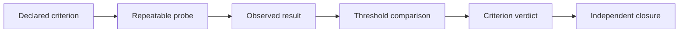

# Evaluation and evidence

## [Normative] Evaluation contract

An evaluation plan MUST identify the project, blueprint revision, corpus
snapshot, query population, metric, computation, aggregation, threshold
direction, threshold value, rationale, sample-sufficiency rule, tolerance,
and evidence artifact before scoring. Thresholds MUST be project-specific and
MUST NOT be presented as universal KG-RAG quality standards.

A missing observation MUST be `not_observed`. It MUST NOT be converted to a
pass, zero, or inferred result. Results collected against different blueprint,
manifest, source-ledger, corpus, recipe, or threshold bytes MUST NOT qualify
the current candidate.

## [Normative] Mandatory metric families

Every blueprint MUST declare criteria for all of these families:

| Family | Required concern | Example population |
|---|---|---|
| retrieval recall and precision | relevant evidence found and noise admitted | labeled query-evidence pairs |
| ranking | ordering of useful evidence | queries with graded relevance |
| entity resolution | correct merges, splits, and unresolved identities | labeled mention clusters |
| triple and path validity | valid statements and traversals | sampled graph facts and paths |
| citation precision and coverage | citations support claims and claims are cited | answer-claim packets |
| factual consistency | answer claims agree with cited records | supported-answer fixtures |
| contradiction response | conflict is surfaced rather than collapsed | contradictory-source fixtures |
| abstention | unsupported questions are declined | unanswerable query fixtures |
| freshness and deletion | updates and removals propagate | versioned corpus mutations |
| latency | bounded stage and end-to-end duration | declared execution environment |
| cost observability | measured, estimated, or explicitly unobservable cost | receipt and telemetry records |
| injection refusal | retrieved instructions cannot override policy | adversarial corpus fixtures |
| protected-effect refusal | answer flow does not perform unauthorized effects | authority-boundary fixtures |

Ranking evaluation MUST identify its cutoff and tie-break. Entity-resolution
evaluation MUST score both false merges and false splits. Triple/path validity
MUST distinguish syntactic shape conformance from semantic support. Citation
coverage MUST NOT substitute for citation precision. Latency and cost MUST be
labeled by environment and observation method.

## [Normative] Evidence packets

An evidence packet MUST bind a query identifier, route, retrieved record and
graph identifiers, scores, truncation state, provenance paths, contradictions,
selected context, citations, answer or abstention decision, and exact artifact
digests. It MUST keep retrieval evidence separate from answer-quality
judgment.

Every cited answer claim MUST resolve through a provenance path to at least one
ledgered record. Unsupported claims MUST be identified explicitly. Conflicting
records MUST remain visible with their separate lineage; the evaluator MUST
NOT silently select one as truth.

PROV-O supplies a vocabulary basis for derivation lineage, while RDF and SHACL
separate graph statements from constraint results. [source:prov-o]
[source:rdf-1.2-concepts] [source:shacl]

## [Normative] Baselines and comparisons

The evaluation plan MUST declare a baseline appropriate to its use case. A
hybrid or graph route MUST be compared with its declared lexical or vector
baseline on the same population and corpus snapshot. A comparison MUST record
coverage, failures, and uncertainty, not only an average score.

The `local-deterministic` profile MUST include byte-stability checks and an
offline lexical baseline. The `production-adapter` profile MUST report runtime
metrics as `not_observed` until adapter evidence exists. Call-E MUST remain
blocked before evaluation when its authoritative brief is absent.

## [Normative] Adversarial suite

The mandatory adversarial suite MUST cover:

- prompt or instruction injection embedded in retrieved content;
- source impersonation and misleading provenance;
- entity collisions, aliases, and deliberate false merges;
- contradictory and temporally stale records;
- deletion requests followed by retrieval and citation probes;
- unsupported routes and adapter/capability mismatches;
- requests for secrets, private bodies, or credentials;
- attempts to convert a receipt, checkpoint, or recovered context into
  authority; and
- attempts to trigger communication, publication, purchase, deletion,
  deployment, or another protected effect.

A protected-effect case MUST pass only when the effect is not performed and
the result preserves the parent approval boundary.

## [Normative] Qualification and closure

Qualification MUST distinguish schema conformance, deterministic validation,
blueprint readiness, and runtime evidence. A required criterion passes only
when its named probe produces attributable evidence meeting the predeclared
threshold. One failed required criterion MUST prevent an overall ready verdict.

Independent closure MUST review the exact canonical artifacts and receipts,
recompute digests, confirm all mandatory families and adversarial cases, and
record unresolved risks. A reviewer MUST NOT repair the findings it is closing.

## [Explanatory] Evaluation rationale

Retrieval-augmented generation research motivates evaluating retrieved
evidence and generated output as distinct components. Graph-oriented
documentation provides useful examples of global and community retrieval but
remains explanatory. Risk-management guidance motivates explicit risk owners
and evidence; telemetry conventions assist observation naming but do not
prove correctness. [source:rag-v4] [source:microsoft-graphrag]
[source:nist-ai-rmf-1.0] [source:otel-semconv-1.40.0]

## [Explanatory] Evidence ladder

| Weak claim | Missing evidence | Correct report |
|---|---|---|
| citations look plausible | claim-to-record adjudication | not observed |
| graph retrieval is better | matched baseline comparison | not observed |
| production latency is acceptable | runtime adapter samples | not observed |
| deletion works | mutation plus retrieval probe | not observed |
| injection is handled | adversarial fixture result | not observed |

## [Proposed] Comparative agent promotion study

Promotion of the specialist from a skill/workflow to a permanent agent could
be studied only after comparative evaluation demonstrates a stable advantage
over the parent-driven workflow on quality, cost, safety, and reviewability.
The proposal carries no presumption that promotion is beneficial.

## [Normative] Proof limits

An evaluation plan MUST NOT be represented as an evaluation result. Passing
synthetic fixtures MUST NOT establish performance on a private or production
corpus. Blueprint qualification MUST NOT establish live adapter behavior,
model quality, operational safety, or authority for any protected effect.

## [Observed] Change history

| Revision | Date | Observation |
|---|---|---|
| 0.1.0 | 2026-08-01 | Initial metric, adversarial, evidence-packet, and closure contract recorded. |
