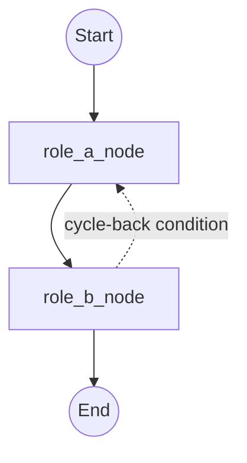

# Orchestration format

A production squad is usually more than one delegated task — it is a small
multi-agent system whose roles pass state between each other, sometimes cycle
back on failure, and remain under explicit operational ceilings. The **ITL
orchestration format**
(`.itl.md`) is how that graph gets written down: a declarative, provider-
neutral file that a session (or a human) reads and drives, not a program
that executes on its own.

This file defines `itl-orchestration/1.0`, `itl-orchestration/2.0`, and additive
`itl-orchestration/2.1`.
Version 2.0 adds delegation and cost-observability budgets without changing
the meaning of a valid 1.0 workflow. Version 2.1 adds manager-orchestrated
composition, locks, read-only fan-out, barriers, and authority-free
checkpoints without changing 1.0 or 2.0. There is no dialect mechanism: a
workflow author chooses one version rather than mixing optional dialects.

## What a `.itl.md` file is not

- **Not executable code.** Agent Nodes declare *which role runs, on what
  inputs, updating what state* — never a literal function body, script, or
  runnable call. A binding renders the declaration into whatever dispatch
  call its platform provides.
- **Not a job for a dedicated runner tool.** There is no orchestration
  engine that parses a `.itl.md` file and walks its graph unattended. The
  orchestrating session reads the Topology and Routing Rules sections
  itself and dispatches each node in turn, exactly as it would dispatch any
  other delegated task under [[core-contract.md]] — a workflow file is a
  script for a session to follow, not a program for a machine to run
  unsupervised.
- **Not where cost numbers live.** The cost *mechanism* — a numeric
  `cost_ceiling_usd`, a `cycle_max`, cost as the running sum of each node's
  actual delegation cost — is normative here. The actual price of a unit of
  delegated work is binding-specific data (it depends on which platform and
  which underlying models a binding uses) and belongs in the binding's own
  pricing source of truth, not hardcoded into this spec.

## File structure

A `.itl.md` file is a Markdown document with a YAML frontmatter header,
followed by these sections in order. Philosophy and Initial State are
optional; every other section is required.

Versions 1.0 and 2.0 remain supported without reinterpretation. Version 2.1
adds an optional Component Nodes section when `components` is non-empty.

```
---
format: itl-orchestration/1.0 | itl-orchestration/2.0 | itl-orchestration/2.1
name: <string>
description: <string>
agents: [<role-identifier>, ...]
state_schema: <TypeName>
routing: fixed | dynamic

# itl-orchestration/1.0 budget
cost_ceiling_usd: <positive number>

# itl-orchestration/2.0 budgets
delegations_max: <positive integer>
cost_observability: observed | estimated | unobservable
cost_ceiling_usd: <positive number; only for observed or estimated cost>

# itl-orchestration/2.1 composition and budgets
components: [<workflow-identifier>, ...]
delegations_max: <positive integer>
concurrency_max: <positive integer>
cost_observability: unobservable

# dynamic routing only, in either version
cycle_max: <positive integer>
created: "<ISO 8601 date>"
version: "<semver>"
tags: [<string>, ...]
---

# Workflow: <name>

## Philosophy          (optional)
## Topology            (required)
## State Schema        (required)
## Agent Nodes          (required)
## Component Nodes      (2.1 only; required when components is non-empty)
## Routing Rules        (required)
## Initial State        (optional)
```

### Frontmatter header

| Field | Meaning |
| --- | --- |
| `format` | Exactly `itl-orchestration/1.0`, `itl-orchestration/2.0`, or `itl-orchestration/2.1`. The selected version determines which fields apply. |
| `name`, `description` | Human-facing identity of the workflow. |
| `agents` | The role identifiers this workflow dispatches to. This list MUST exactly equal the set of roles named by `Dispatches to` in Agent Nodes: no omitted or unused roles. A role identifier is meaningful to the binding, not to this spec — this spec never enumerates concrete role names. |
| `state_schema` | The name of the type declared in State Schema. |
| `routing` | `fixed` — an acyclic graph, with no cycle-back rules and no `cycle_max` field permitted. `dynamic` — the graph may cycle back per Routing Rules; a `cycle_max` is then required. |
| `cost_ceiling_usd` | A numeric hard ceiling on total cost across all nodes. Version 1.0 requires it as that format's concrete numeric budget. In 2.0 it is required only for observed or estimated cost and forbidden for unobservable cost. It is one valid realization of [[core-contract.md]]'s numeric-budget rule, not the only one. |
| `delegations_max` | Versions 2.0 and 2.1: positive-integer ceiling on all node dispatches, including retries and cycle-backs. |
| `cost_observability` | Version 2.0: exactly `observed`, `estimated`, or `unobservable`; version 2.1 requires `unobservable`. |
| `components` | Version 2.1 only: workflow identifiers invoked by Component Nodes, exactly matching their `Invokes workflow` values. An empty list is valid. |
| `concurrency_max` | Version 2.1 only: positive-integer ceiling checked before each dispatch. |
| `cycle_max` | Maximum number of cycle-back iterations. Required when `routing: dynamic` and forbidden when `routing: fixed`. |
| `created`, `version`, `tags` | Bookkeeping: authorship date, the workflow file's own semver, free-text tags. |

#### Version 2.0 budgets

A 2.0 workflow uses `format: itl-orchestration/2.0` and adds these normative
frontmatter fields:

| Field | Meaning |
| --- | --- |
| `delegations_max` | Positive-integer ceiling on all node dispatches, including retries and cycle-backs. |
| `cost_observability` | Exactly `observed`, `estimated`, or `unobservable`. |
| `cost_ceiling_usd` | Positive numeric ceiling, required only for observed or estimated cost and forbidden when cost is unobservable. |
| `cycle_max` | Positive-integer cycle-back ceiling, required for dynamic routing and omitted for fixed routing. |

The 2.0 State Schema MUST include `delegations_so_far` as an integer
accumulator. It MUST include `cost_usd_so_far` only when a USD ceiling applies.
Estimated cost is a planning signal, not a billing claim. When cost is
unobservable, `delegations_max` remains an enforceable operational ceiling.

The driving session MUST check the delegation ceiling before every dispatch,
the cycle ceiling before every cycle-back, and any applicable USD ceiling
before dispatch. A retry consumes a delegation. A cycle-back consumes both a
delegation and a cycle. Reaching any ceiling stops the workflow before another
dispatch.

#### Version 2.1 composition

2.1 adds `components: [<workflow-identifier>, ...]` and mandatory positive integer
`concurrency_max`; it requires `delegations_max` and
`cost_observability: unobservable`. `agents` still exactly matches direct
`Dispatches to` roles, while `components` exactly matches `Invokes workflow`
aliases in an optional `Component Nodes` section. A component node declares
`Invokes workflow`, relative `Source`, `Access`, `Inputs from state`, and `On
return`; each mapping names declared state fields and explicitly overwrites
with `=` or accumulates with `+=`. Component sources MUST use relative POSIX
paths, remain within the workflow root, and resolve to regular non-symlink
files. References MUST be acyclic, declare compatible 2.1 versions, and match
the binding registry's authoritative workflow. A component may declare
`Execution mode: prove-only`; a read-only component containing gated writer
nodes MUST do so and map `child.repair_authority = false`.

Every 2.1 Agent Node declares `Access: read-only` or
`Access: workspace-write`. Fan-out is allowed only if every branch is
read-only through its explicit barrier; a node with multiple forward
predecessors MUST declare `Join requires` with exactly those predecessors and
a `Repair owner`. The barrier cannot run until every predecessor completes.
The parent may serialize eligible fan-out. A cycle-back starts a new bounded
execution epoch for affected nodes. Retries and cycle-backs count against all
applicable global and component-local ceilings before dispatch. Reaching any
limit stops before dispatch, never afterward.

The complete graph MUST be validated, flattened, and bound to a deterministic
[[workflow-lock.md]] before the first dispatch. Expanded node identifiers are
namespaced by component instance. Unknown roles, component aliases, mappings,
transitions, result shapes, paths, or versions stop the workflow before
another dispatch. The manager alone drives the locked graph: a component's
children do not start additional agents.

### Philosophy (optional)

Prose. Why this workflow exists, what proved the shape works, and any
constraint that shaped the graph but doesn't belong in a machine-checkable
field (e.g., an output path convention, a rationale for why routing is
`dynamic` rather than `fixed`). Skip it for a workflow simple enough that
the graph speaks for itself.

### Topology (required)

A diagram of the node graph. Rendered as a Mermaid `graph` block — a
notation, not a platform primitive, so it stays provider-neutral:

The topology MUST contain the literal endpoints `START` and `END`, connecting
the declared workflow graph from its entry to its exit. Labels may render those
endpoints for humans, but they do not replace the literal identifiers.



### State Schema (required)

The shared state every node reads from and writes to, in Python-flavored
pseudocode (a `TypedDict`-style block with `Annotated[..., operator.add]`
marking accumulator fields). Every binding built against this spec so far
is Python-based, and the syntax is already widely legible even to readers
who don't write Python — so this spec keeps it rather than inventing a
neutral field-table notation. A future binding for a language where this
reads as noise may propose a second notation then; it is not designed for
speculatively now.

Two kinds of field:

- **Scalar** — overwritten by whichever node ran most recently.
- **Accumulator** (`Annotated[List[...], operator.add]` or
  `Annotated[float, operator.add]`) — grows: each node run appends or adds
  to it rather than replacing it.

Every workflow's state schema MUST include the seven [[core-contract.md]]
result-contract fields as accumulators — `summary`, `evidence`,
`artifacts_or_changed_files`, `verification`, `risks_or_unknowns` (accumulate,
one entry per node run) plus `status` and `recommended_next_route`
(scalar, overwritten by the latest node). This is a deliberate rejection of
a separate workflow-only vocabulary: a workflow's state is built from the
same contract every single delegated task already reports through, not a
parallel set of fields with the same meaning under different names.

```python
class ExampleState(TypedDict):
    # ── workflow-specific fields ──
    <field>: <type>

    # ── required result-contract accumulators ──
    summary: Annotated[List[str], operator.add]
    evidence: Annotated[List[str], operator.add]
    artifacts_or_changed_files: Annotated[List[str], operator.add]
    verification: Annotated[List[str], operator.add]
    risks_or_unknowns: Annotated[List[str], operator.add]
    status: str
    recommended_next_route: str

    # ── 1.0 cost tracking, or 2.0 when a USD ceiling applies ──
    cost_usd_so_far: Annotated[float, operator.add]

    # ── required in 2.0 ──
    delegations_so_far: Annotated[int, operator.add]
```

### Agent Nodes (required)

Each node is a **pure declarative mapping** — never executable code, not
even lightweight pseudocode with a function signature. A node states which
role it dispatches to, which state fields populate that delegation's task
envelope ([[core-contract.md]]), and which state fields its result contract
populates on return:

```markdown
### <node_name>
- **Dispatches to:** <role-identifier>
- **Task envelope from state:** objective = <derivation>; context = <state
  fields>; scope = <state fields or literal>; constraints = <state fields>;
  budget = `cost_ceiling_usd` − `cost_usd_so_far`
- **On return:** appends <accumulator fields>; sets <scalar fields>
```

Only the task-envelope and result-contract fields actually driven by state
need to be listed — a node with fixed `scope`/`constraints` for every run
may state them as literals rather than a state-field derivation.

In 2.1, every node also declares `Access`. A barrier adds `Join requires` and
`Repair owner`; a conditionally enabled node adds `Enabled when`:

```markdown
### <node_name>
- **Dispatches to:** <role-identifier>
- **Access:** read-only | workspace-write
- **Enabled when:** <field> == true
- **Join requires:** `<predecessor_a>`, `<predecessor_b>`
- **Repair owner:** `<node_name>`
- **Task envelope from state:** <declarative mapping>
- **On return:** <declarative mapping>
```

### Component Nodes (2.1 only)

Each component node names a reusable 2.1 workflow and explicit state
boundaries. Input targets are child fields; their values are parent fields or
literals. Return sources are child fields; each parent target uses overwrite
or accumulator semantics matching its State Schema annotation.

```markdown
### <component_instance>
- **Invokes workflow:** `<workflow-identifier>`
- **Source:** `<relative-workflow.itl.md>`
- **Access:** `read-only` | `workspace-write`
- **Execution mode:** `prove-only`
- **Inputs from state:** `child.repo_dir = parent.repo_dir`
- **On return:** `parent.findings += child.findings; parent.status = child.status`
```

### Routing Rules (required)

Plain-English rules governing which node runs next, written to the grammar
in [[#formal-grammar]] below. Three rule shapes:

- **Conditional** — `If <predicate> then <action>.`
- **Cycle-back** — `Cycle-back if <predicate>: re-run from <node> (max
  <cycle_max> cycles).` Only valid when `routing: dynamic`.
- **Checkpoint** — `Checkpoint after <node>: persist state to <path>.`

A dynamic workflow MUST declare at least one bounded cycle-back rule using the
cycle-back shape above. A fixed workflow MUST NOT declare a cycle-back rule or
the `cycle_max` frontmatter field. The integer in every cycle-back rule MUST
equal that workflow's frontmatter `cycle_max`; a rule cannot silently declare
a narrower or wider ceiling than the workflow-wide counter that enforces it.

### Initial State (optional)

A table of starting values for the workflow's state fields, replacing the
older convention of a literal state-initialization code block — a table
reads the same regardless of the binding's implementation language:

| Field | Initial value |
| --- | --- |
| `<field>` | `<value>` |

Omit this section when a workflow's starting state is fully determined by
the caller at dispatch time rather than by fixed defaults.

## Formal grammar

Routing Rule predicates use this grammar. It extends the original
field-operator-value form with a `contains` membership test over a list of
structured records — needed the moment a routing rule has to ask "does any
open finding have `fix_owner == coder`?" rather than compare a single
scalar field.

```ebnf
predicate        = disjunction ;
disjunction       = conjunction , { "AND" , conjunction } ;  (* AND binds tighter than OR: an OR term is a full conjunction *)
conjunction       = comparison , { "OR" , comparison } ;
comparison        = field-comparison | contains-comparison ;

field-comparison   = field-ref , comparator , value ;
comparator         = "==" | "!=" | ">" | ">=" | "<" | "<=" ;

contains-comparison = field-ref , "contains" , struct-predicate ;
struct-predicate    = field-name , "==" , value ;
  (* true if ANY element of the list/collection referenced by field-ref
     has field-name equal to value *)

field-ref          = field-name ;
field-name         = identifier , { "_" , identifier } ;
value               = string-literal | number | boolean | field-ref ;
identifier          = letter , { letter | digit } ;

rule                = conditional-rule | cycle-back-rule | checkpoint-rule ;
conditional-rule     = "If" , predicate , "then" , action , "." ;
cycle-back-rule       = "Cycle-back if" , predicate , ":" ,
                         "re-run from" , node-name ,
                         "(max" , integer , "cycles)" , "." ;
checkpoint-rule        = "Checkpoint after" , node-name , ":" ,
                          "persist state to" , path , "." ;

action              = "abort, return partial results"
                      , [ "with priority" , priority ]
                    | "escalate to" , role-ref
                    | free-text ;
priority            = "low" | "medium" | "high" ;
node-name           = identifier ;
role-ref            = identifier ;
```

Worked predicate, in grammar terms — `open_findings contains
fix_owner==coder`: `field-ref` = `open_findings`, `struct-predicate` =
`fix_owner==coder` (`field-name` = `fix_owner`, `value` = `coder`). Reads
as: true if any element of the `open_findings` list has a `fix_owner` field
equal to `coder`.

A predicate with no `contains` clause is just the original v1.0
field-operator-value form (`cost_usd_so_far > cost_ceiling_usd`) — the
extension is additive, not a breaking change to what a simple routing rule
looks like.

## Read-only validation

The repository ships a standard-library linter at `scripts/lint_itl.py`. It
validates frontmatter, required sections, state fields, topology, agent-node
and component consistency, mappings, joins, routing grammar, paths, budget
combinations, fan-out access, recursion, and bounded cycles for all three
format versions. It only reads the supplied workflow and returns diagnostics;
it never dispatches a role, executes a command, follows a graph, or writes a
checkpoint.

That module also exposes `enforce_runtime_limits()`, a pure pre-dispatch
predicate for a driving session. Given an already validated workflow and the
caller's current delegation, cycle, and optional USD counters, it returns
normally when another dispatch is within every declared ceiling and raises a
diagnostic when a ceiling is exhausted or a required counter is absent. It
does not mutate state, advance or execute the graph, dispatch a role, run a
command, or persist a checkpoint. The parent session remains responsible for
graph control and counter updates; this helper is not a workflow runner.

## See also

- [[core-contract.md]] — the task-envelope and result-contract fields every
  Agent Node's declaration is built from.
- [[routing-principles.md]] — why routing decisions are made by task shape,
  not label, and why a heuristic earns permanence rather than being
  assumed one (the same discipline that ruled out a dialect mechanism
  here).
- [[workflow-lock.md]] — canonical graph locking, source revalidation, and
  authority-free checkpoint/resume semantics for 2.1.
- A worked, binding-concrete example lives in each binding's own
  directory, e.g. `bindings/<platform>/examples/extract-repo.itl.md`.
